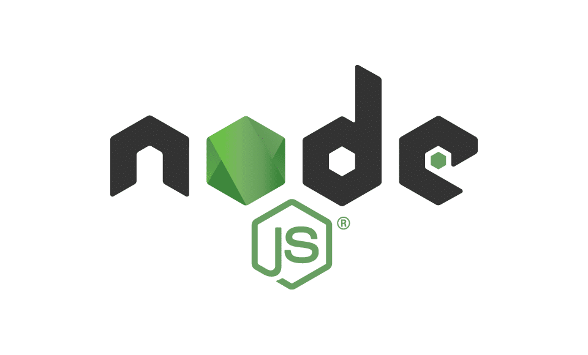
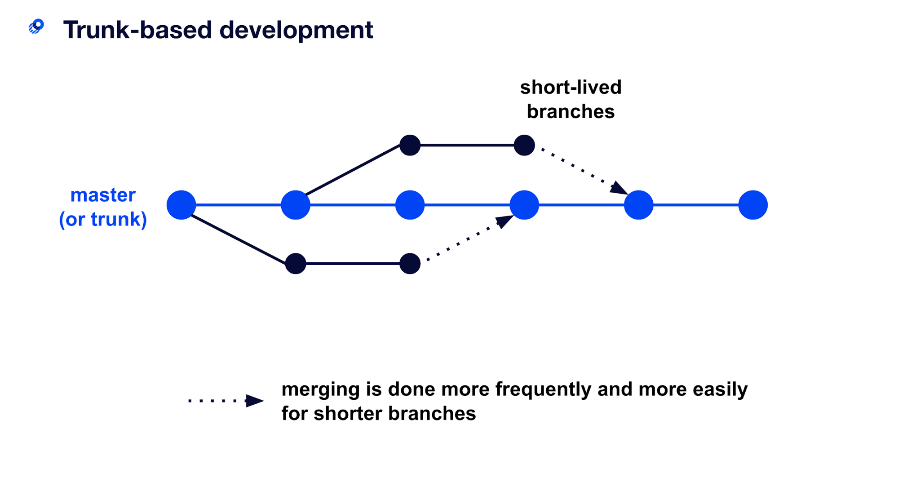
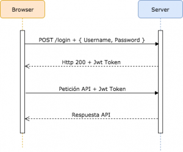
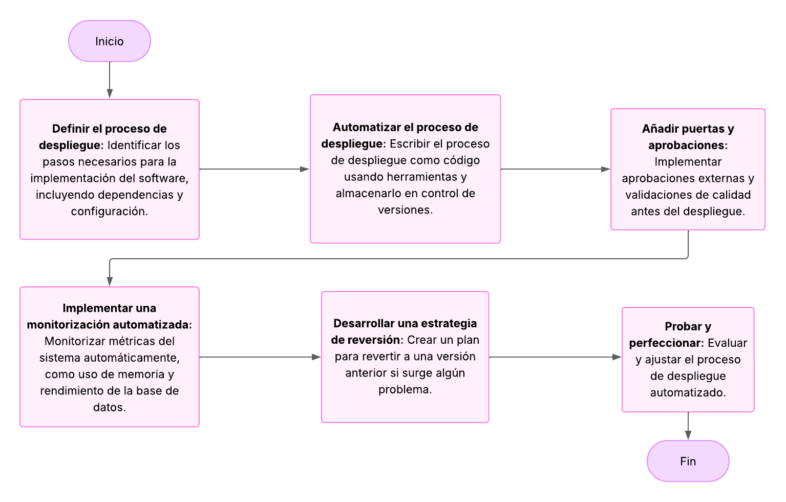
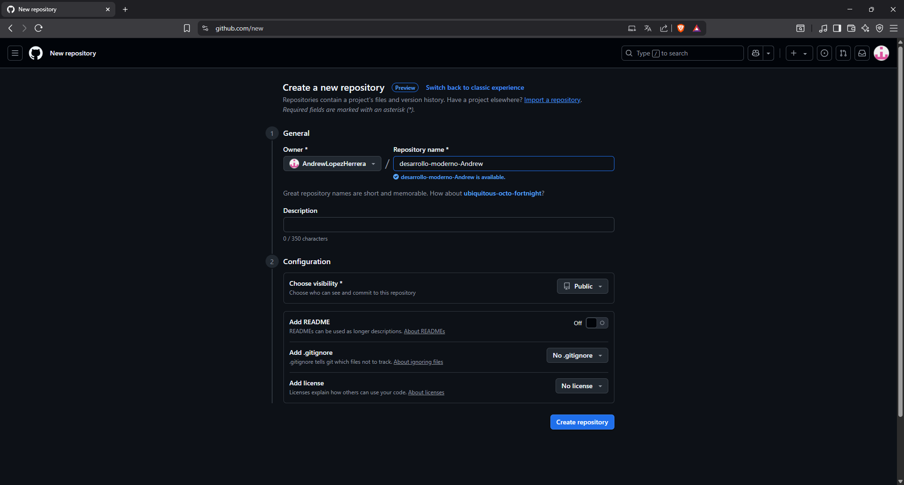
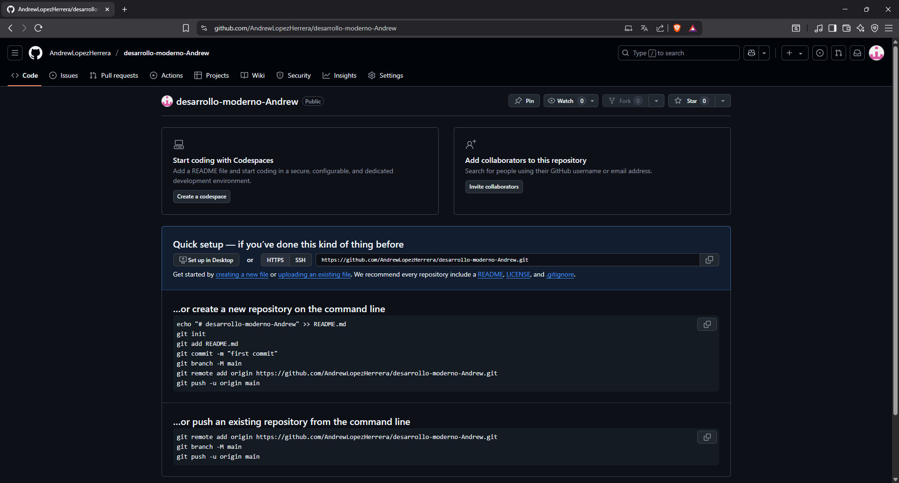
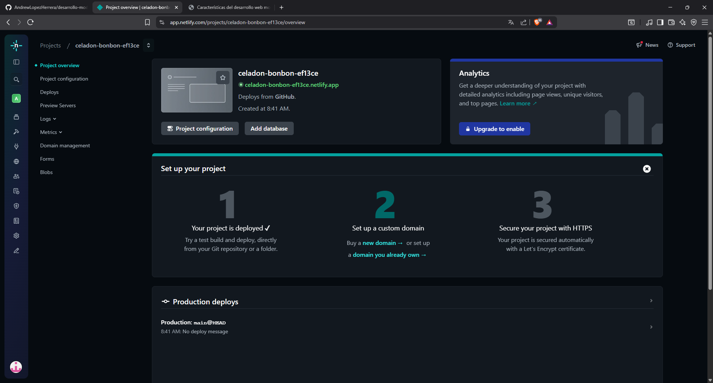
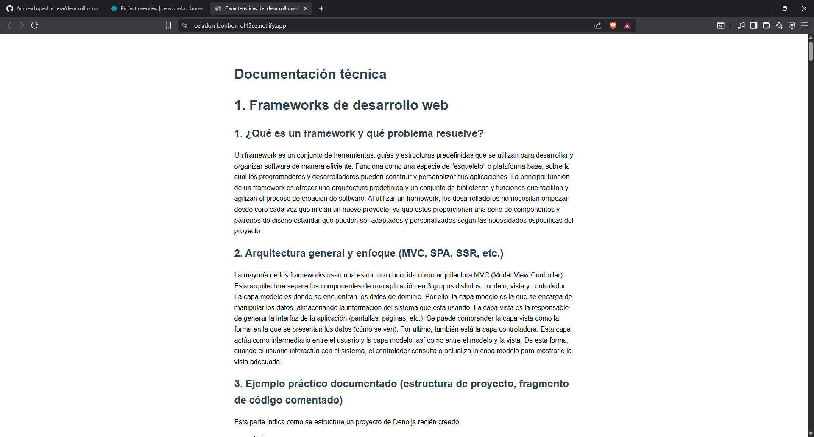

# 1. Frameworks de desarrollo web

## 1. ¿Qué es un framework y qué problema resuelve?

Un framework es un conjunto de herramientas, guías y estructuras predefinidas que se utilizan para desarrollar y organizar software de manera eficiente. Funciona como una especie de "esqueleto" o plataforma base, sobre la cual los programadores y desarrolladores pueden construir y personalizar sus aplicaciones.
La principal función de un framework es ofrecer una arquitectura predefinida y un conjunto de bibliotecas y funciones que facilitan y agilizan el proceso de creación de software.
Al utilizar un framework, los desarrolladores no necesitan empezar desde cero cada vez que inician un nuevo proyecto, ya que estos proporcionan una serie de componentes y patrones de diseño estándar que pueden ser adaptados y personalizados según las necesidades específicas del proyecto.

## 2. Arquitectura general y enfoque (MVC, SPA, SSR, etc.)

La mayoría de los frameworks usan una estructura conocida como arquitectura MVC (Model-View-Controller). Esta arquitectura separa los componentes de una aplicación en 3 grupos distintos: modelo, vista y controlador.
La capa modelo es donde se encuentran los datos de dominio. Por ello, la capa modelo es la que se encarga de manipular los datos, almacenando la información del sistema que está usando.
La capa vista es la responsable de generar la interfaz de la aplicación (pantallas, páginas, etc.). Se puede comprender la capa vista como la forma en la que se presentan los datos (cómo se ven).
Por último, también está la capa controladora. Esta capa actúa como intermediario entre el usuario y la capa modelo, así como entre el modelo y la vista. De esta forma, cuando el usuario interactúa con el sistema, el controlador consulta o actualiza la capa modelo para mostrarle la vista adecuada.

## 3. Ejemplo práctico documentado (estructura de proyecto, fragmento de código comentado)

Esta parte indica como se estructura un proyecto de Deno.js recién creado

```
my_project
├── deno.json
├── main_test.ts
└── main.ts
```

Este ejemplo de TypeScript, tiene la información de tipo adicional que admite TypeScript.

```typescript
//Pone la primera letra del nombre en mayúscula
function capitalize(word: string): string {
  return word.charAt(0).toUpperCase() + word.slice(1);
}

//Saluda a la persona
function hello(name: string): string {
  return "Hello " + capitalize(name);
}

console.log(hello("john")); //Imprimir datos
console.log(hello("Sarah")); //Imprimir datos
console.log(hello("kai")); //Imprimir datos
```

## 4. Comparación breve entre al menos dos frameworks (según lenguaje o enfoque)

## Deno.js


### Pros y Contras de Deno

### Pros

1. Funciones de seguridad mejoradas
2. Compatibilidad nativa con TypeScript
3. Gestión de dependencias simplificada
4. Biblioteca estándar integrada
5. En general, Deno facilita la escritura de código seguro y mantenible sin depender de bibliotecas o herramientas de terceros.

### Contras

1. Ecosistema y comunidad menos maduros
2. Soporte limitado de bibliotecas de terceros
3. Puede requerir volver a aprender ciertos conceptos y prácticas
4. El lenguaje y la arquitectura subyacente de Deno pueden requerir más tiempo de comprensión, lo que hace que la curva de aprendizaje sea más pronunciada.

## Node.js



## Pros y Contras de Node.js

### Pros

1. Ecosistema maduro y bien establecido
2. Gran comunidad y amplio soporte de bibliotecas
3. Trayectoria probada en diversos sectores y proyectos

### Contras

1. Posibles problemas de seguridad
2. Falta de compatibilidad nativa con TypeScript
3. API inconsistentes y falta de una biblioteca estándar integrada

# 2. Control de versiones y trabajo colaborativo

## 1. ¿Qué es el control de versiones y por qué es esencial?

El control de versiones, también conocido como "control de código fuente", es la práctica de rastrear y gestionar los cambios en el código de software. Los sistemas de control de versiones son herramientas de software que ayudan a los equipos de software a gestionar los cambios en el código fuente a lo largo del tiempo.
Pasar de un sistema de control de versiones centralizado a Git cambia la forma en que tu equipo de desarrollo crea software. Y si tu empresa depende de su software para aplicaciones críticas, la modificación del flujo de trabajo de desarrollo afecta a toda la empresa.

## 2. Conceptos clave: repositorio, commit, branch, merge, pull request.

**Repositorio:** Un repositorio es un lugar donde se guarda algo. Generalmente, se refiere a un espacio destinado a la conservación y almacenamiento de objetos, documentos o información, facilitando su acceso y protección.
**Branch:** Git Branch es un comando del sistema de Git que permite crear, listar o eliminar ramas del sistema. Una rama de desarrollo es una bifurcación del estado del código que origina un nuevo camino para la evolución del mismo.
**Merge:** Incorpora los cambios de las confirmaciones nombradas (desde el momento en que su historias divergieron de la rama actual) en la rama actual rama.
**Commit:** Crea una nueva confirmación con el contenido actual del índice y el mensaje de bitácora dado que describe los cambios.
**Pull request:** Incorpora los cambios de un repositorio remoto a la rama actual.

## 3. Flujos de trabajo comunes (Git Flow, trunk-based, feature branches).

### Git Flow

Gitflow es un modelo alternativo de bifurcación de Git que implica el uso de ramas de características y varias ramas principales. En lugar de una sola rama, este flujo de trabajo utiliza dos ramas para registrar el historial del proyecto. La rama almacena el historial de versiones oficial y la rama sirve como rama de integración para las características. También es conveniente etiquetar todas las confirmaciones de la rama con un número de versión.


### trunk-based

El desarrollo basado en troncos es una práctica de control de versiones en la que los desarrolladores fusionan pequeñas actualizaciones de forma frecuente en un "tronco" o rama principal. Dado que esta práctica simplifica las fases de fusión e integración, ayuda a lograr la CI y la CD y, al mismo tiempo, aumenta la entrega de software y el rendimiento de la organización.



### feature branches

El flujo de trabajo de la rama de funciones asume un repositorio central y main representa la historia oficial del proyecto. En lugar de comprometerse directamente con su rama local main, los desarrolladores crean una nueva rama cada vez que comienzan a trabajar en una nueva característica. Las ramas de funciones deben tener nombres descriptivos, como elementos de menú animados o número 1061. La idea es dar un propósito claro y muy enfocado a cada rama. Git no hace ninguna distinción técnica entre main rama y ramas de funciones, para que los desarrolladores puedan editar, preparar y confirmar cambios en una rama de funciones.


## 4. Ejemplo de cómo usar Git en un proyecto (inicialización, commits, ramas).

### Ejemplo de inicialización
```bash
git init
```

### Ejemplo para commits

```bash
#Agregar todos los cambios.
git add .

#Realizar los cambios en el repositorio.
git commit -m "Initial commit"
```

### Ejemplo para ramas

```bash
#Crear una nueva rama.
git checkout -b new-feature

#Enviar un cambio a la nueva rama.
git status
git add <some-file>
git commit
```

## 5. Herramientas recomendadas.

**1. GitHub:** GitHub es una herramienta esencial para los ingenieros de software, y su popularidad es inigualable. Actualmente cuenta con más de 25 millones de usuarios. Se trata de un número considerable de profesionales que recurren a GitHub para mejorar el flujo de trabajo y la colaboración.

**2. GitLab:** Gitlab es una plataforma web para la gestión del ciclo de vida del desarrollo de software mediante el control de versiones de código fuente, sirviendo también como repositorio online para almacenar proyectos. Se trata de una de las opciones más interesantes del mercado para el desarrollo colaborativo que compite con plataformas como GitHub y Bitbucket.

**3. BitBucket:** Bitbucket Cloud es una herramienta de alojamiento de código y colaboración basada en Git diseñada para equipos. Las inmejorables integraciones de Bitbucket con Jira y Trello están concebidas para unir a todo el equipo de software con el fin de poner en práctica un proyecto.
 
**4. AWS CodeCommit:** CodeCommit es un servicio de control de código fuente gestionado, seguro y altamente escalable que aloja repositorios Git privados. CodeCommit elimina la necesidad de gestionar tu propio sistema de control de código fuente o de preocuparte por escalar su infraestructura. Se puede utilizar CodeCommit para almacenar cualquier cosa, desde código hasta binarios. Además, es compatible con las funciones estándar de Git, por lo que funciona perfectamente con las herramientas existentes basadas en Git.

# 3. Autenticación y seguridad moderna

## 1. Conceptos

**Autenticación:** La autenticación es el proceso que usan las empresas para confirmar que solo las personas, servicios y aplicaciones adecuados con los permisos correctos pueden acceder a recursos de la organización. Es una parte importante de la ciberseguridad porque la mayor prioridad de un infiltrado es obtener acceso no autorizado a los sistemas.

**Autorización:** La autorización es un proceso en el que se otorga a un usuario acceso a una red o a un recurso del sistema.

**Tokens:**  Un "token" es un objeto o código que se utiliza para representar la autorización de un usuario o dispositivo para acceder a un recurso o servicio. Los tokens son utilizados comúnmente en los sistemas de autenticación y seguridad de la información.

**JWT:** Los JSON Web Tokens (JWT) son un estándar abierto, que se define en Especificación RFC 7519 del token web JSON (JWT) . Representan de forma segura reclamos entre dos partes. Los reclamos pueden estar relacionados con cualquier proceso comercial, pero generalmente se usan para representar una identidad y sus asociaciones. Por ejemplo, un usuario cuya identidad representa el JWT pertenece a una función o grupo de administrador.

**OAuth:** OAuth es un estándar tecnológico que permite autorizar a una aplicación o servicio a iniciar sesión en otro sin divulgar información privada, como contraseñas. OAuth significa Autorización Abierta—no autenticación, como a veces se supone que es. OAuth está diseñado para funcionar con el Protocolo de transferencia de hipertexto (HTTP). Utiliza tokens de acceso para demostrar su identidad y permitirle interactuar con otro servicio en su nombre.

## 2. Diagrama de flujo explicativo del proceso de autenticación con JWT.

Este digrama de flujo UML explica como se inicia sesión utilizando JWT.
1. El usuario debe enviar las credenciales al sistema.
2. El servidor devuelve la respuesta con el código 200 y con el token JWT.
3. Ahora, cada vez que se haga una petición se envía el token JWT, esto es para validar que el usuario haya iniciado sesión.
4. El usuario recibe la respuesta del servidor.



## 3. Buenas prácticas en seguridad web.

1. **Crear un modelo de amenaza de aplicación web:** Al establecer esta comprensión básica de su panorama de aplicaciones, allana el camino para una estrategia de seguridad de aplicaciones web más estructurada y efectiva. Además, se emplean modos de implementación de documentos, capas de aplicación y medidas de seguridad existentes dentro de cada aplicación. Este enfoque holístico garantiza que se contabilicen todos los activos y permite realizar parches de vulnerabilidad rápidos y eficientes cuando sea necesario.

2. **Ordenar las aplicaciones en cubos prioritarios:** Definir prioridades inmediatamente después o durante el proceso de inventario de la aplicación.

|          | **Descripción** |
|----------|----------|
| **Crítico**  | Aquí pertenecen las aplicaciones externas que se ocupan de datos confidenciales de clientes y transacciones monetarias. Estas aplicaciones son objetivos principales para los piratas informáticos y deben probarse y solucionarse como prioridad.   |
| **Serio**    | En esta categoría entran tanto las aplicaciones externas como las internas que contienen información confidencial de la empresa y de los clientes. Deben abordarse rápidamente después de aplicaciones críticas.   |
| **Normal**   | Si bien es posible que los piratas informáticos no ataquen estas aplicaciones directamente, aún deberían someterse a pruebas y correcciones, aunque más tarde.   |

3. **Implementar parches virtuales / WAF:** Implementar correcciones provisionales es esencial para detener la explotación mientras se desarrollan soluciones a largo plazo.

|          | **Descripción** |
|----------|----------|
| **Obtener un firewall de aplicaciones web (WAF)**  | El tráfico enrutado a través de un WAF se bloquea si es malicioso. El firewall avanzado de aplicaciones web incluso admite reglas personalizadas para bloquear la explotación de cualquier vulnerabilidad, genérica o específica de la lógica de la aplicación.   |
| **Restringir funcionalidad:**    |  Restricciones como acceso limitado a la base de datos de usuarios, tiempo de espera de sesión y otras pueden ayudar a prevenir algunos de los ataques.   |

4. **Monitoreo continuo de aplicaciones :** Estos análisis contribuyen a crear inteligencia de seguridad y mejorar la eficiencia de la seguridad de las aplicaciones. Además, el seguimiento resulta eficaz para contrarrestar la aplicacióncapa Ataques DDoS.
El parche virtual a través de WAF no solo proporciona beneficios en términos de “tiempo de reparación” sino que también ofrece monitoreo continuo de aplicaciones web. Otorga visibilidad de las vulnerabilidades bloqueadas, sus orígenes y las acciones de los atacantes antes y después de intentar la explotación.

5. **Escaneo automatizado + pruebas de penetración:** Las pruebas automatizadas de aplicaciones son vitales para identificar vulnerabilidades, pero pueden pasar por alto fallas lógicas. Se debe complementar con pruebas de penetración realizadas por expertos capacitados para simular ataques similares a los de los piratas informáticos.

## 4. Aplicaciones reales en plataformas modernas.

# 4. Gestores de contenido desacoplados (Headless CMS)

## 1. Definición de Headless CMS vs CMS tradicional.

**Headless CMS:** Arquitectura CMS sin cabeza desacopla las funciones front-end (donde se diseña, formatea y entrega el contenido) de las funciones back-end (donde se crea, administra y almacena el contenido). El puente que conecta a ambos —y en cierto sentido les permite “hablar” con cada uno y realizar diversas tareas— es la tecnología de interfaz de programación de aplicaciones (API). Debido a este papel central y crucial de las API, los CMS sin cabeza a veces se denominan CMS “API-first”.

**CMS tradicional:** Un CMS tradicional utiliza un enfoque categóricamente diferente al de un CMS sin cabeza. En lugar de estar desacoplados, el front-end y el back-end están intrínsecamente conectados. Básicamente, no existe un front-end: todo el contenido, los diseños, los activos digitales y las aplicaciones personalizables se administran y almacenan en el back-end. Debido a esta arquitectura todo en uno, los CMS tradicionales a menudo se denominan CMS “monolíticos”.

## 2. Arquitectura basada en APIs.

La arquitectura API es un conjunto de reglas y prácticas que proporcionan un marco para diseñar, desarrollar y prestar servicios web. La arquitectura API define cómo una interfaz de programación de aplicaciones (API) interactúa con los demás componentes de su sistema.

Esto incluye cómo las API se comunican con bases de datos, aplicaciones y otros sistemas. También expone datos con código de estado http o varios códigos de estado, o código de estado http o varios códigos de estado, un código de estado http que determina cómo se intercambian datos entre diferentes componentes de sistemas distribuidos y cómo se accede a la información asociada a recursos externos.

## 3. Ventajas, limitaciones y casos de uso comunes.

### **Ventajas**

1. **Seguridad:** La seguridad de los datos está en el primer plano de la mente de todos los desarrolladores, especialmente con la creciente sofisticación de las amenazas cibernéticas. Las API abordan esta preocupación de frente. Actúan como guardianes, regulando meticulosamente quién o qué puede acceder a datos o funcionalidades específicas. Más allá del mero acceso, las API también pueden registrar actividades, rastrear el comportamiento del usuario y marcar anomalías.

2. **Mayor productividad:** Las API, o interfaces de programación de aplicaciones, sirven como herramientas valiosas para amplificar la productividad de los desarrolladores’. Reducen sistemáticamente la carga de tareas repetitivas al ofrecer funciones preconfiguradas.

3. **Mayor velocidad de integración:** Disponer de APIS permite la integración de servicios y otros terceros lo que a su vez agiliza la comunicación entre la empresa y sus clientes, promoviendo la automatización y escalabilidad. Esta es la razón por la que Jeff Bezos de Amazon enfatizó en un memorando a su personal que todos los servicios deben proporcionar API y conectarse entre sí mediante esas API.

4. **Transformar la experiencia del cliente:** na API interna se puede utilizar para una variedad de propósitos y puede ayudar a que las operaciones comerciales de toda la organización funcionen sin problemas. Además, las empresas pueden poner sus API a disposición de los socios, quienes pueden mejorarlas y ofrecer a los clientes una interacción omnicanal más completa.

5. **Competitividad:** Los bancos han adoptado API y estándares de banca abierta, mientras que Netflix, Stripe, AWS y UBER han tenido éxito, por eso han puesto las API en primer lugar porque saben que tener API les permite ser competitivos. Una API sólida permite que su aplicación y terceros, socios comerciales y clientes integren un sistema de revisión rápida con otro sistema.

**Limitaciones**

1. **Complejidad de configuración inicial y dependencia del desarrollador:** La implementación de CMS sin cabeza introduce un nivel de complejidad técnica que simplemente no existe con los sistemas tradicionales. La separación entre frontend y backend requiere conocimientos técnicos especializados de los que muchas organizaciones carecen internamente. Se necesitará desarrolladores que comprendan a fondo el diseño de API, los protocolos de seguridad y las capacidades de integración.

2. **Sin edición visual ni vista previa en vivo por defecto:** Para los creadores de contenido, la transición a un CMS sin interfaz gráfica a menudo supone un cambio radical en la experiencia de edición. Los autores de contenido acostumbrados a los editores WYSIWYG con frecuencia tienen dificultades con las interfaces abstractas basadas en formularios que suelen proporcionar los sistemas sin cabeza.

3. **Mayor costo de propiedad para equipos pequeños:** El costo total de operar un CMS sin cabeza va mucho más allá de las tarifas de licencia iniciales. Las organizaciones más pequeñas con recursos limitados a menudo consideran que estos costos son prohibitivos cuando se consideran todos los factores.

**Casos de comunes**

1. **Se necesita la flexibilidad para construir:** Un CMS sin cabeza permite a las empresas crear lo que desean para adaptarse a un caso de uso particular. Por el contrario, los CMS tradicionales pueden bloquear a los desarrolladores en el uso de ciertos marcos o tecnologías y no permitirles construir como mejor les parezca.

2. **Se desea aprovechar el contenido como servicio (CaaS):** Contenido como servicio (CaaS) es un modelo orientado a servicios en el que el “Proveedor de servicios” entrega el contenido bajo demanda al “Consumidor de servicios” a través de servicios de suscripción autorizados basados en la nube.

## 4. Ejemplo de cómo se conecta el frontend a un CMS headless.

Un CMS headless como Strapi da una URL para acceder al contenido, por ejemplo:

```
https://mi-cms.com/api/articulos
```

Esa ruta devuelve un JSON con la información que el editor subió al CMS:

```json
{
  "data": [
    {
      "id": 1,
      "attributes": {
        "titulo": "Primer artículo",
        "contenido": "Este es el contenido del artículo...",
        "imagen": {
          "url": "https://mi-cms.com/uploads/imagen1.jpg"
        }
      }
    }
  ]
}
```

En React, se puede usar fetch para obtener los datos:

```jsx
import { useEffect, useState } from "react";

function App() {
  const [articulos, setArticulos] = useState([]);

  useEffect(() => {
    fetch("https://mi-cms.com/api/articulos")
      .then((res) => res.json())
      .then((data) => setArticulos(data.data))
      .catch((err) => console.error(err));
  }, []);

  return (
    <div>
      <h1>Artículos del CMS</h1>
      {articulos.map((articulo) => (
        <div key={articulo.id}>
          <h2>{articulo.attributes.titulo}</h2>
          
          <p>{articulo.attributes.contenido}</p>
        </div>
      ))}
    </div>
  );
}

export default App;
```

# 5. Pasarelas de pago en aplicaciones web

## 1. ¿Qué es una pasarela de pago? ¿Qué rol cumple en una aplicación moderna?

Una pasarela de pagos es una plataforma tecnológica que actúa como intermediaria en las transacciones económicas electrónicas. Permite que las empresas físicas y en línea acepten, procesen y gestionen diversos métodos de pago (tales como tarjetas de crédito, tarjetas de débito o monederos digitales) de forma segura y eficiente. La pasarela de pagos salva la brecha entre el cliente, la empresa y sus respectivas entidades financieras.
Una pasarela de pagos desempeña varias funciones importantes para velar por que los pagos se lleven a cabo de manera segura, eficiente y exacta:

**Cifrado:** Cuando un cliente envía la información del pago al finalizar una compra en línea, la pasarela de pagos cifra los datos.

**Conexión con el procesador de pagos:** La pasarela de pagos conecta el proceso de compra del cliente con el proveedor de procesamiento de pagos.

**Autorización:** La pasarela de pagos envía los datos cifrados de la transacción al banco adquiriente de la empresa que, a su vez, envía la información al banco emisor del cliente o al procesador de pagos pertinente.

**Recopilación de datos e informes:** Las pasarelas de pagos suelen proporcionar a las empresas datos valiosos que les facilitan el análisis y la gestión de las transacciones.

**Detección y prevención del fraude:** Para minimizar el riesgo de que se produzcan transacciones fraudulentas, las pasarelas de pagos aplican medidas de seguridad avanzadas, como los algoritmos de detección del fraude, los sistemas de verificación de domicilio (AVS) o las comprobaciones del valor de verificación de la tarjeta (CVV).

# 2. Requisitos comunes: cuenta de comercio, seguridad, integración técnica.

- **Cuenta de comercio:** Una cuenta comercial se refiere a una cuenta bancaria comercial que permite a las empresas aceptar pagos electrónicos por bienes y servicios. Esto incluye pagos con tarjeta de crédito, tarjetas de débito y otras opciones de pago que requieren una cuenta comercial para procesar pagos, como comprobaciones electrónicas.

- **Seguridad:** La seguridad en los pagos hace referencia a los sistemas, procesos y medidas empleadas para proteger las transacciones financieras del acceso no autorizado, las filtraciones de datos y el fraude. Para las empresas en línea y con establecimientos físicos, garantizar la seguridad en los pagos es importante para mantener la confianza de los clientes, minimizar las pérdidas financieras y cumplir con las normativas relevantes y los estándares del sector.

- **Integracion técnica:** unificar procesos y flujos operativos para eliminar ineficiencias y garantizar una mayor calidad general en los servicios.
  - **Integración mediante API:** permite personalizar completamente el flujo de pago, por lo que está recomendado para empresas grandes o con una capacidad técnica importante. 
  - **Plugins y extensiones:** solución más rápida para plataformas como WooCommerce o Shopify, ideal para pequeños ecommerce. 
  - **Redirección a pasarela externa:** aquí el cliente es dirigido a la plataforma de pago externa y luego regresa al sitio web.

## 3. Ventajas y limitaciones de integrar pagos en línea.

**Ventajas**

1. **Mejora de la experiencia del cliente:** Los clientes modernos esperan disfrutar de una experiencia de compra intuitiva, flexible y sin complicaciones. Una pasarela de pagos facilita el cumplimiento de estas expectativas. Permite a los clientes realizar pagos en cualquier momento y lugar y desde cualquier dispositivo.

2. **Mayor seguridad:** Las pasarelas de pagos implementan medidas de seguridad estrictas para proteger la información confidencial del cliente. Utilizan tecnologías de cifrado avanzadas y protocolos seguros para salvaguardar datos, como los números de las tarjetas de crédito, contra posibles fraudes y filtraciones de datos.

3. **Procesamiento más rápido:** Con las pasarelas de pagos, se utilizan procesos automatizados para gestionar las transacciones con más rapidez que con el procesamiento manual. Esta velocidad hace posible una experiencia de compra ágil para los clientes y acelera el ciclo para las empresas, lo que mejora el flujo de caja.

4. **Expansión mundial:** Para las empresas que desean expandir su alcance a todo el mundo, una pasarela de pagos reviste un valor incalculable. Muchas de ellas admiten varias divisas, lo que permite a las empresas atender a clientes en diversos países. Esta prestación resulta especialmente beneficiosa para las organizaciones que venden productos o servicios internacionalmente, pues hace posible que acepten pagos en las divisas locales de sus clientes.

**Limitaciones:**

1. **Comisiones y Costos Adicionales:** La mayoría de pasarelas cobran una comisión por transacción, lo que puede afectar los márgenes de beneficio, especialmente en negocios pequeños. Es importante analizar estos costes antes de elegir un proveedor.

2. **Dependencia de Terceros:** Usar una pasarela implica confiar en un tercero para procesar pagos. Fallos o interrupciones pueden detener las ventas y generar mala experiencia para el cliente. Contar con un proveedor fiable y un plan de contingencia es clave.

## 4. Comparación entre al menos dos pasarelas (ej. Stripe, TiloPay, Bancos, etc.)

| Servicio                                        | PayPal                                                                                      | Raya                    |
|-------------------------------------------------|---------------------------------------------------------------------------------------------|-------------------------|
| **Tarifas de transacción** [1]                  | 3,49% + 49¢                                                                                 | 2,9% + 30¢              |
| **Tarjetas de crédito desde su sitio web**      | $30 / mes [2]                                                                               | Gratis                  |
| **Chargeback**                                  | $20                                                                                         | $15                     |
| **Expreso americano**                           | 3,5% [3]                                                                                    | Misma tarifa plana      |
| **Micropagos (menos de $10)**                   | 5% + 0,05¢                                                                                  | Misma tarifa plana      |
| **Reembolso**                                   | Solo se devuelve la tarifa fija [4]                                                         | Tarifas no devueltas    |
| **Tarjetas internacionales**                    | 1% [5]                                                                                      | Gratis [6]              |
| **Autorizar tarjeta**                           | 30¢ [7]                                                                                     | Gratis                  |
| **Facturación recurrente**                      | \$10 / mes (Herramienta de pago recurrente opcional: \$30 / mes)                              | Gratis                  |
| **Protección contra el fraude**                 | Básico gratis; Avanzado \$10 / mes [8]                                                       | Gratis              |

1. Tarifas de transacción de Estados Unidos. Las tarifas de transacción de Stripe y Paypal varían según el país.

2. PayPal Payments Pro le permite brindar una experiencia de pago totalmente personalizada en el sitio e incluye Terminal Virtual.

3. La tarifa de American Express solo se cobra para PayPal Payments Pro, PayPal Payments Advanced y Virtual Terminal, lo cual es necesario para ciertas funciones.

4. Parte de la tarifa fija de la tarifa de transacción original (por ejemplo, la tarifa de reembolso es de $0,30 para pagos nacionales).

5. Tarifas transfronterizas de PayPal.

6. Las tarjetas internacionales son gratuitas, pero la conversión de moneda cuesta un 2%.

7. PayPal cobra 30¢ por autorizaciones no capturadas y transacciones de verificación de tarjetas.

8. \$10 mensuales + \$0,05 por transacción. Excluye transacciones de pago exprés.

# 6. Automatización del despliegue y hosting moderno

## 1. ¿Qué es CI/CD y por qué se usa en desarrollo web?

CI/CD es un proceso de desarrollo de software que permite a los equipos de TI realizar cambios de software con frecuencia y confiabilidad. Cualquier proyecto de software normalmente cuenta con un equipo de desarrolladores que trabajan para mejorar y mantener el software en un entorno preliminar o exclusivo para desarrolladores. Realizan cambios de código en el entorno de desarrollo y luego trasladan la versión final a producción, donde los usuarios finales pueden acceder a las actualizaciones.

## 2. Hosting estático vs dinámico.

Un sitio web estático se compone de páginas web creadas utilizando HTML, CSS y Javascript (todos ejemplos de desarrollo web idiomas). Cada página de un sitio web estático se almacena como un único archivo HTML, que se envía directamente desde el servidor a la página web exactamente tal como está. Este contenido esencialmente se convierte en parte del diseño de su página y no cambiará a menos que el archivo HTML original se edite a nivel de código.
Creados utilizando lenguaje y tecnología del lado del servidor, los sitios web dinámicos permiten que el contenido de cada página se entregue y muestre dinámicamente, o sobre la marcha, según el comportamiento del usuario o a partir de contenido generado por el usuario.

| | Estático | Dinámico|
|-|-|-|
|**Ventaja**|Velocidad de carga de páginas más rápida|Fácilmente actualizado|
|**Ventaja**|Creación rápida|Una mejor experiencia de usuario|
|**Ventaja**|Menores costos de alojamiento|Mayor funcionalidad|
|**Ventaja**|Potencial de mayor seguridad|Potencial de personalización|
|**Desventaja**|Escalabilidad limitada|Se necesitan más recursos para crear|
|**Desventaja**|Gestión menos eficiente|Problemas de rendimiento|

## 3. Flujo de despliegue automatizado.



## 4. Documentar el proceso seguido para desplegar la parte 2 del laboratorio.

1. Crear el repositorio



***

2. Se ha creado el repositorio.



***

3. Se está subiendo los archivos por medio de GitHub Desktop


4. Se subió el proyecto a Netlify



5. El sitio ya se encuentra disponible

